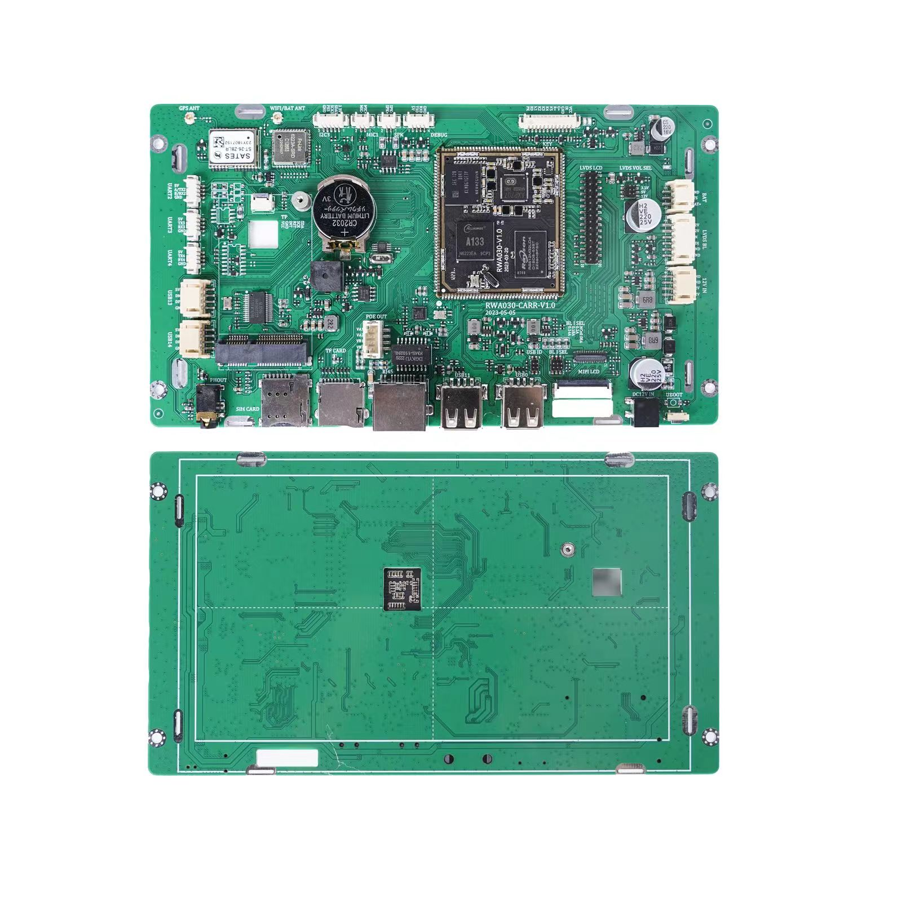
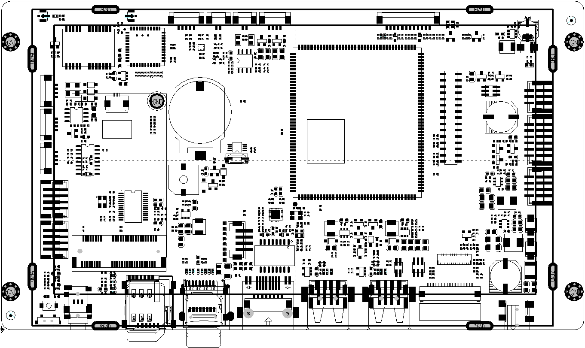

# Allwinner A133-7inch-HMI

## 7inch HMI Pictures Show
- 7inch HMI Interfaces and Functions

- HMI PCBA and LCD View

- HMI PCBA and LCD View

- HMI PCBA Top and Bottom View

- HMI PCB View

- HMI PCB Size (186.3mm*105.4mm)

[Download DXF file of PCB-SIZE](./Documents/RWA030-CARR-V1.0-20230411-SIZE.dxf) ｜ 
[Download PDF file of PCB-SIZE](./Documents/RWA030-CARR-V1.0-20230411-SIZE.pdf)

# 7inch HMI Documents
- [【01】7inch HMI CPU A133 Datasheet.pdf](./Documents/A133_Datasheet_V1.1.pdf)
- [【02】7inch HMI LCD AN0708 Datasheet.pdf](./Documents/AN0708-B3EI302-37E501.pdf)
- [【03】7inch HMI PCB SIZE.pdf](./Documents/RWA030-CARR-V1.0-20230411-SIZE.pdf)
- [【04】7inch HMI PCB SIZE.dxf](./Documents/RWA030-CARR-V1.0-20230411-SIZE.dxf)
- [【05】7inch HMI PCB TOP View.pdf](./Documents/RWA030-CARR-V1.0-20230411-TOP.pdf)
- [【06】7inch HMI PCB TOP View.dxf](./Documents/RWA030-CARR-V1.0-20230411-TOP.dxf)

# 7inch HMI Firmware Update tools
- [7inch HMI Firmware Update tools (PhoenixSuit_EN) Download](./Documents/PhoenixSuit_EN.msi)
- [7inch HMI Firmware Update tools (PhoenixSuit_EN) UserUser Manual](./Documents/PhoenixSuit.pdf)

# Contacts

- Website: www.we-signage.com
- https://we-signage.en.made-in-china.com/
- E-mail: dennis@we-signage.com
- MP/Whatsapp/Wechat: + 86 13349909990
- Skype: solled686